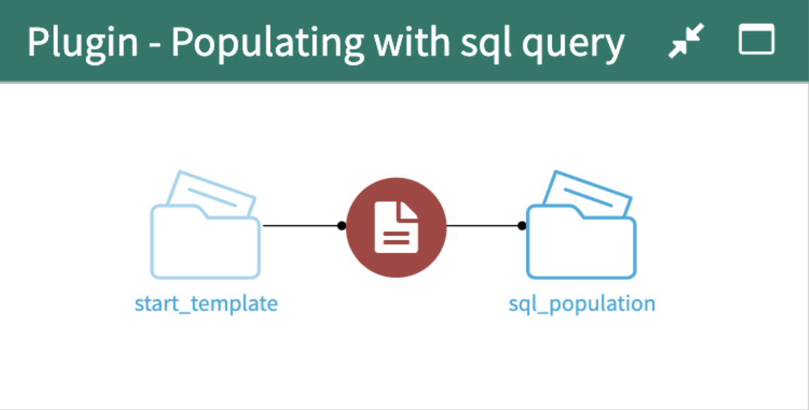
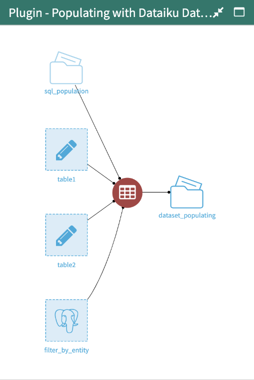
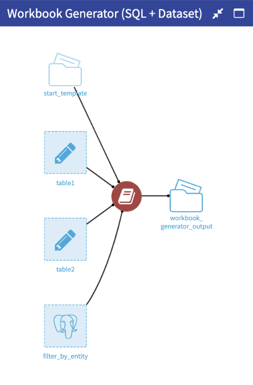

# Excel Templater

  

This Dataiku plugin is composed of three components:
- Automatic Insert of SQL table into Excel template
- Automatic Insert of DSS dataset into Excel template
- Combination of 1 and 2 into one recipe

1. Automatic Insert of SQL table into Excel template

Preview of final Component

- Component type
Visual Recipe Plugin

- Brief Description: 
Provide a multi sheet excel template with (or without) tagged Cells containing a SQL Query.
Run through all the sheets and look for a tag. If a tag is found, extract SQL query and replace variables with their equivalent project variables.
Run the SQL query extracted from that cell and write the resulting dataset with the top right corner at the tag’s position.
Write the resulting excel file in an output folder.

- Input Parameter:
Query Tag
Connection (all queried tables must be accessible through this SINGLE SQL connection)

- DSS Input
Managed Folder (Containing excel template)
Can be stored on any File System connection

- DSS Output 
Managed Folder (Containing Excel file template populated with data)
Can be stored on any File System connection

- Specification on the tag structure
A query must be formatted as : {SQL_TAG}{SQL_Query}
Reference variables in a query using @{variable_name}. 
Any combination of characters and underscores following the @ will be used as the variable name and looked for in the project variables.

2. Automatic Insert of DSS dataset into Excel template

- Preview of final Component

- Component type
Visual Recipe Plugin

- Brief Description 
Input multiple datasets to your plugin and a managed Folder containing an excel Template.
In each sheet look for a “tagged cell” 
From this tag, extract the Dataiku dataset name, extract the data associated with this dataset and write the resulting dataset with the top right corner at the tag’s position.
Output the resulting excel to a managed folder.

- Input Parameter
Tag name (to be looked for in each sheet)

- DSS Input
Dataiku datasets (containing the data to use to populate the excel template)
Can be stored in any dataiku dataset with read access.
One Dataiku metadata dataset (Mapping a dataset to an excel sheet)
Can be stored in any dataiku dataset with write access.
Manage Folder (Containing the template Excel to be populated)
Can be stored on any File System connection.

- DSS Output 
Managed Folder 
Can be stored on any File System connection

3. Combination of 1 and 2 into one recipe

- Preview of final Component
 

- Component type
Visual Recipe Plugin

- Brief Description: 
Has the same specification as component 1 & 2 but does it in one recipe

- Input Parameter:
Same as 1 & 2 combined

- DSS Input :
Same as component 2

- DSS Output : 
Managed Folder (Containing Excel file template populated with data)
Can be stored on any File System connection
